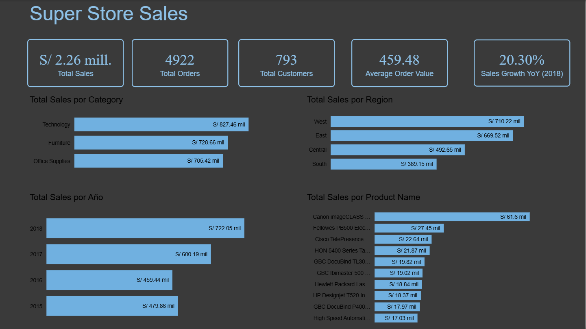

# Superstore Sales Dashboard

Este proyecto presenta un análisis de ventas utilizando Power BI con el dataset Superstore. 
El objetivo es identificar tendencias de ventas, rendimiento por región y productos más vendidos.

## Dashboard

## Herramientas utilizadas

- Power BI
- DAX
- Data Visualization

## KPIs principales

- Total Sales
- Total Orders
- Total Customers
- Average Order Value
- Sales Growth YoY

## Insights principales

- **Technology** es la categoría con mayores ventas (**aprox. 827.46 mil**).
- **West** es la región con mayor volumen de ventas (**aprox. 710.22 mil**).
- Las ventas muestran una **tendencia de crecimiento constante entre 2016 y 2018**.
- **Canon imageCLASS** es el producto con mayores ventas individuales (**aprox. 61.1 mil**).
- El análisis por subcategoría muestra que **Phones y Copiers** concentran gran parte de los ingresos dentro de Technology.
- La distribución geográfica evidencia que las **regiones West y East lideran el desempeño comercial** frente a Central y South.
- El dashboard permite identificar **productos y regiones con mejor rendimiento**, facilitando la toma de decisiones comerciales.

## Dataset

El dataset contiene información de:

- órdenes
- clientes
- productos
- regiones
- ventas

## Archivos

- `SuperStore_Dashboard.pbix` → dashboard completo
- `data/train.csv` → dataset utilizado
